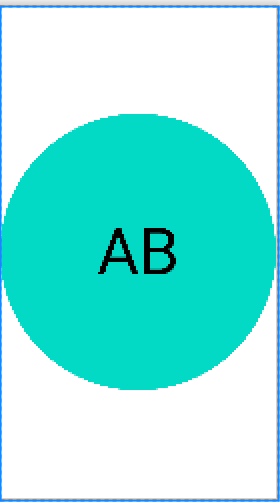
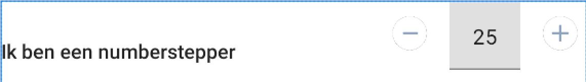
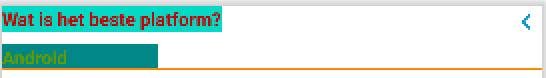
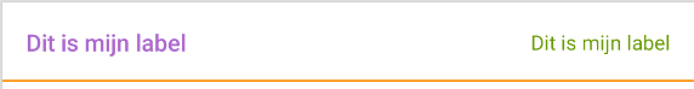

# Core

## Table of Contents

1. [Gradle Dependency](#gradle-dependency)
2. [Initialize](#initialize)
3. [Base Classes](#base-classes)
   1. [BaseVM...](#basevm)
   2. [BaseBindingVM...](#basebindingvm)
4. [Custom Views](#custom-views)

---

## Gradle Dependency

This Core module can be added by using this dependency. It contains BaseClasses for ViewModel, Fragments, and Activities. Also a lot of extension functions can be found.

```groovy
dependencies {
  ...
  implementation 'com.github.appwise-labs.AndroidCore:core:<Latest-Version>'
}
```

Don't forget to also add the "navigation-safe-args" plugin to the project level build.gradle

```groovy
dependencies {
  ...
  classpath "androidx.navigation:navigation-safe-args-gradle-plugin:<Latest-Navigation-Version>"
}
```

Android Studio could prompt you with an error if you're building an app with this library as a dependency. To fix that issue just add the next code snippet.

```
packagingOptions {
    exclude 'META-INF/core_release.kotlin_module'
}
```

The reason behind this is that another library that's called `core` is added to the build as well which is causing an issue [more can be read here](https://discuss.kotlinlang.org/t/disable-meta-inf-generation-in-gradle-android-project/3830).

A possible solution is to rename our Core library to AppwiseCore or something

---

## Initialize

The Core module, at the moment, can technically be used without initialization. Though, to use the full functionality it is recommended to do the initialization. This can be done in the `Application` class.

Doing so will give you a couple of options, you can initialize a Default Error Activity to show instead of the old (and ugly) pop-up of Android itself. Another option is to set if the Logger should be active for this build and which tag it should use by default.

```kotlin
CoreApp.init(this)
    .initializeErrorActivity(BuildConfig.DEBUG)
    .initializeLogger("LoggingTag", BuildConfig.DEBUG)
    .build()
```

Do note, that when you use AndroidCore as a Dependency that the `isLoggable` parameter in `initializeLogger()` should be added. It is best to use `BuildConfig.DEBUG` as the parameter so the logs won't show up in a production build.

---

## Base classes

To reduce some boilerplate code whilst creating new Fragments or Activities you can use these BaseClasses

- BaseFragment | BaseActivity
- BaseVMFragment | BaseVMActivity
- BaseBindingVMFragment |BaseBindingVMActivity

Do mind, that by using the `BaseBindingVM` equivalent you will automatically be using the other 2 as well. The hierarchy is as follows:

`BaseBindingVMFragment` -------extends-------> `BaseVMFragment` -------extends-------> `BaseFragment`

---

### BaseVM...

By using `BaseVM...` you will need to override the value `mViewModel`. After that is set, the `DefaultExceptionHandler` will also be set automatically

```kotlin
override val mViewModel: MainViewModel by viewModels()
```

With `BaseVM...` you also have the option to add a custom `viewModelFactory` to it. For this to work you just need to override the function `getViewModelFactory()`

```kotlin
override fun getViewModelFactory() = SplashViewModel.factory("someValue")
```

You can then add the factory to the declaration of the `mViewModel`

```kotlin
override val mViewModel: MainViewModel by viewModels() {
    MainViewModel.factory("someValue")
}
```

---

### BaseBindingVM...

Everything that applies to `BaseVM...` applies to this class as well. A couple of things to add to this is that the Binding class is expecting a Generic (of the Binding-Layout). You'll also have to override a function `getLayout()` to finish the basic setup for DataBinding

```kotlin
class MainFragment : BaseBindingVMFragment<FragmentMainBinding>() {
    override fun getLayout() = R.layout.fragment_main

}
```

If you have any variables in your layout that you wish to dataBind to it, you'll have to do that yourself in the `onCreate()` (for Activities) or `onViewCreated()` (for Fragments)

```kotlin
override fun onCreate(savedInstanceState: Bundle?) {
    super.onCreate(savedInstanceState)

    mBinding.run {
        viewModel = mViewModel
    }
}

// OR

override fun onViewCreated(view: View,s savedInstanceState: Bundle?) {
    super.onViewCreated(view, savedInstanceState)

    mBinding.run {
        viewModel = mViewModel.apply {
            // After the viewModel has been initialized you can use the functions and variables like normal
            fetchData()
        }
    }
}

```
## Custom Views
All classes that are used to create fast , easy and commonly used views/components.

### InitialsImageView
This view makes it easier to show a Circular version of a Profile's image and that can show a short text when this image can't be loaded as a placeholder. The text has to be short and is mostly used to show Initials for the given profile.

With this View comes an easy Interface called Profile which your classes can implement.
Every object that implements this interface and overrides these 2 functions can be set on to the InitialsImageview in xml with databinding  `profile="@{profileobject}"` 
and with `initialsImageview.setProfile(profile)` setter in Kotlin or Java.

```Kotlin
interface Profile {
    fun getImage(): String?
    fun getInitials(): String
    }
```

<p align="center">
  
</p>

```xml
 <be.appwise.core.ui.custom.InitialsImageView
    style="@style/customIivStyle"
    android:layout_width="wrap_content"
    android:layout_height="wrap_content"/>

 <style name="customIivStyle">
    <item name="circleColor">@color/teal_200</item>
    <item name="android:textColor">@color/black</item>
    <item name="android:textSize">@android:color/holo_purple</item>
 </style>

```

You can also style the text of the InitialsImageView with

```xml
 <style name="iiv_initialsText">
    <item name="android:textAppearance">@style/TextAppearance.AppCompat.Caption</item>
    <item name="android:textColor">@android:color/black</item>
 </style>
```


### NumberStepper
This view combines a minus-button , plus-button and a inputfield to 1 component and is used to bump small amounts of numbers. It is possible to change the icons of the buttons and style the icons and edittext. You can also set a range of values with the min and max value.

<p align="center">
  
</p>


```xml
 <be.appwise.core.ui.custom.NumberStepper
     android:id="@+id/numberStepper"
     style="@style/customNumberPickerStyle"
     android:layout_width="wrap_content"
     android:layout_height="wrap_content"
     app:layout_constraintTop_toBottomOf="@id/pabCustom"
     app:layout_constraintStart_toStartOf="parent"
     app:layout_constraintEnd_toEndOf="parent" />


 <style name="customNumberPickerStyle">
    <item name="label">Ik ben een numberpicker</item>
    <item name="plus_icon">@drawable/ic_chevron_left</item>
    <item name="minus_icon">@drawable/ic_chevron_right</item>
    <item name="minValue">0</item>
    <item name="maxValue">100</item>
 </style>
```

You can also override the styles for the label and the edittext by overriding these styles in your themes.xml

```xml 
 <style name="numberStepper_label">
    <item name="android:textAppearance">@style/TextAppearance.AppCompat.Body2</item>
 </style>

 <style name="numberStepper_edittext" parent="@style/Widget.MaterialComponents.TextInputLayout.FilledBox"/>
```

### ProfileActionButton
This view is combines a label, a inputfield and a next button and is used to show or edit data and be used as navigation button. You can also choose to show/hide a divider. You can change the color and style of all components. It has a horizontal and a vertical orientation. 

<p align="center">
  
</p>

```xml

 <be.appwise.core.ui.custom.ProfileActionButton
    android:id="@+id/pabCustom"
    android:layout_width="match_parent"
    android:layout_height="wrap_content"
    app:pab_title="dddddd"
    style="@style/customPabStyle"
    app:layout_constraintTop_toTopOf="parent"
    app:layout_constraintStart_toStartOf="parent"
    app:layout_constraintEnd_toEndOf="parent"
    app:layout_constraintHorizontal_bias="0.0" />

 <style name="customPabStyle">
    <item name="pab_title">Wat is het beste platform?</item>
    <item name="pab_subTitle">Android</item>
    <item name="pab_hint">Selecteer platform</item>

    <item name="pab_titleTextColor">@android:color/holo_red_dark</item>
    <item name="pab_titleTextAppearance">@style/customTitleTextAppearance</item>

    <item name="pab_subTitleTextColor">@android:color/holo_green_dark</item>
    <item name="pab_subTitleTextAppearance">@style/customSubTitleTextAppearance</item>

    <item name="pab_nextIconColor">@android:color/holo_blue_dark</item>
    <item name="pab_nextIcon">@drawable/ic_chevron_left</item>

    <item name="pab_dividerColor">@android:color/holo_orange_dark</item>
    <item name="pab_vertical">true</item>
    <item name="pab_visibleDivider">false</item>
    <item name="pab_visibleNextIcon">false</item>
 </style>
```

### ProfileDataRow
This view combines a textview and a edittext and is to be used to show data with its label.

<p align="center">
  
</p>

```xml

 <be.appwise.core.ui.custom.ProfileDataRow
    android:id="@+id/pdrCustom"
    style="@style/customPdrStyle"
    android:layout_width="wrap_content"
    android:layout_height="wrap_content"
    app:layout_constraintTop_toBottomOf="@id/numberStepper"
    app:layout_constraintStart_toStartOf="parent"
    app:layout_constraintEnd_toEndOf="parent" />

 <style name="customPdrStyle">
    <item name="labelText">Dit is mijn label</item>
    <item name="valueHint" >Ik ben de hint</item>
    <item name="labelTextColor" >@android:color/holo_purple</item>
    <item name="valueTextColor">@android:color/holo_green_dark</item>
    <item name="valueHintColor">@android:color/holo_red_dark</item>
    <item name="visibleDivider">true</item>
    <item name="dividerColor" >@android:color/holo_orange_dark</item>
    <!--adjust keyboard for the child edittext-->
    <item name="android:imeOptions">actionDone</item>
    <!--adjust keyboard for the child edittext-->
    <item name="android:inputType">textPersonName</item>
    <!--enable/disable input-->
    <item name="editable" >true</item>
    <!--multiple lines or not-->
    <item name="singleLine">true</item>
 </style>
```


