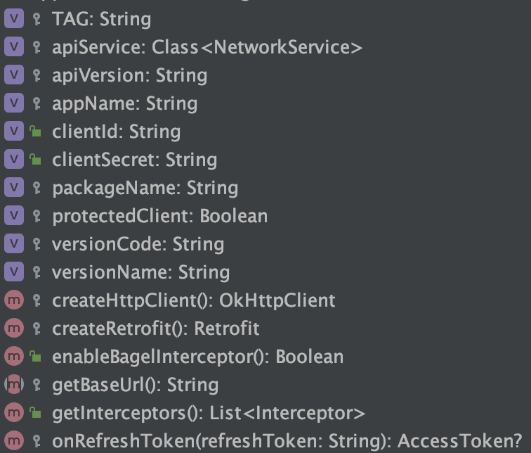

# Networking

## Table of Contents

1. [Gradle Dependency](#gradle-dependency)
2. [Usage](#usage)
3. [RestClient](#restclient)
4. [New way to make calls](#new-way-to-make-calls)
5. [Proxyman Interceptor](#proxymaninterceptor)

---

## Gradle Dependency

The `Networking` module contains base classes and extensions to add Networking (through Retrofit) to the application.

```groovy
dependencies {
    ...
    implementation 'com.github.appwise-labs.AndroidCore:networking:<Latest-Version>'
}
```

---

## Usage

In order to use all functionality of the `Networking` module it is necessary to instantiate some things in the `Application` class.

```kotlin

Networking.Builder()
    .registerProxymanService(this)
    .setPackageName(packageName)
    .setAppName(getString(R.string.app_name))
    .setVersionCode(BuildConfig.VERSION_CODE.toString())
    .setVersionName(BuildConfig.VERSION_NAME)
    .setClientSecretValue(BuildConfig.CLIENT_SECRET)
    .setClientIdValue(BuildConfig.CLIENT_ID)
    .setApiVersion(BuildConfig.API_VERSION)
    .build()
```

After this is done you can start off by extending the `RestClient`.

---

## RestClient

When implementing a Restclient in your project you can extend from `BaseRestClient`. Do mind that you still have a
choice to implement the RestClient as an `object` or as a regular `class`. (Each time you call the
class `AppRestClient()` it'll create a new instance, while calling the object `AppRestClient` retains the same instance)

In your RestClient you can have multiple apiServices to accommodate for the multitude of Repositories in the project, or
you can have 1 single apiService.

```kotlin
object UnProtectedRestClient : BaseRestClient() {

    override val protectedClient = false
    override fun getBaseUrl() = "https://www.apiEndpoint.com/api/v1/"

    // Shorthand to create a service for the default 'httpClient'
    val taskService = getService<TaskNetworkService>()

    // Longer version to create a service for the default 'htppClient'
    val authService: AuthNetworkService by lazy {
        getRetrofit.create(AuthNetworkService::class.java)
    }

    // If the service requires a specific retrofit client instance with other settings you can override it like this, 
    // or create a separate networking Client for it all together.
    val userService: UserNetworkService by lazy {
        createRetrofit("https://www.apiEndpoint.com/api/v1/user")
            .create(UserNetworkService::class.java)
    }

    val settingsService: SettingsNetworkService by lazy {
        // This behaves the same as using 'createRetrofit(baseUrl)',
        // but offers more options by using the builder itself.
        getRetrofit.newBuilder()
            .baseUrl("https://www.apiEndpoint.com/api/v1/settings")
            .build()
            .create(SettingsNetworkService::class.java)
    }
}
```

Within the RestClient class, you have a lot of flexibility to adjust it to your requirements. Just take look at the
possible functions and parameters to override.

<p align="center">
  
</p>

---

## New way to make calls

### Interface

Some changes have been made, to obtain more flexibility in regard to handling the different responses of a network call,
Instead of just getting the response or an exception we can get more information by using the new `NetworkResponse`
object.

```kotlin
@GET("/tasks/{id}")
suspend fun fetchTask(
    @Path("id") taskId: String
): NetworkResponse<TaskResponse, ApiError>
```

By default this will map any issues from the server to an `ApiError` object. In case the `ApiError` is not sufficient
you can use a custom Error object to do the mapping.

```kotlin
@GET("/tasks/{id}")
suspend fun fetchTask(
    @Path("id") taskId: String
): NetworkResponse<TaskResponse, MyApiError>
```

In the case that the `ApiError` is needed for all calls you can use this shorthand which is a typealias for
the `NetworkResponse` and will always use the `ApiError` object

```kotlin
@GET("/tasks/{id}")
suspend fun fetchTask(
    @Path("id") taskId: String
): BaseResponse<TaskResponse>
```

---

**NOTE** Do mind the `suspend` in front of the network call functions. With the new response type we can use coroutines
natively.

---

### Repository

To invoke the actual network call function we don't need to use `doCall` anymore. Instead, we can just use the function
as is

```kotlin
object ApiRepo : BaseRepository {

    private val apiService = ApiRestClient.retrofitService

    suspend fun fetchTask(id: String) = apiService.fetchTask(id)
}
```

By default it would suffice to simply have it like this, but in most cases we want to do something with the data before
we just return it to the ViewModel, e.g. save it to Room. To do that, we can manually check the response type if it is a
success or not, or we can take advantage of the extension function `handleSuccessAndReturnResponse`.

```kotlin
object ApiRepo : BaseRepository {

    private val apiService = ApiRestClient.retrofitService

    suspend fun fetchTaskManual(id: String) = apiService.fetchTask(id).also {
        if (it !is NetworkResponse.Success) return@also

        // Automatically smart cast `it` to `it as NetworkResponse.Success`, so no extra check needed
        dao.createTask(it.body)
    }

    suspend fun fetchTaskManual(id: String) = apiService.fetchTask(id).handleSuccessAndReturnResponse {
        dao.createTask(it.body)
    }
}
```

### ViewModel

Sometimes a network request results in an error because of invalid entries or the server not responding. In those cases
the `NetworkResponse<*, *>` would hold information about that error. To show this error to the user, we have to parse
the error out of the `NetworkResponse` and then provide a way to show this via i.e. a dialog, a snackbar,...

```kotlin
fun fetchTaskById(id: String) = launchAndLoad {
   
    val result = apiRepo.fetchTaskById("2718")
   
    when (result) {
        is NetworkResponse.Success -> { /* Do something with the data, if you want to use network only data */ }
        is NetworkResponse.NetworkError -> setCoroutineException(result.error)
        is NetworkResponse.ServerError -> setCoroutineException(result.error)
        is NetworkResponse.UnknownError -> setCoroutineException(result.error)
    }
}
```

Doing it like this will **not** cancel the parent coroutine whenever an error occurs for the network call. You can handle that yourself if needed.

---

**NOTE** Because the all the error types are subclassed from `Error` we can also write this shorthand for a common error handling
```kotlin
when (result) {
   is NetworkResponse.Success -> { /* Do something with the data */ }
   is NetworkResponse.Error -> setCoroutineException(result.error)
}
```

---

Another way to handle the responses is by using the extension function `handleResponse` that is available in the `BaseViewmodel`.
Using this function will (by default) have the same functionality as the `doCall` function, which will result in the error being thrown to the Fragment/Activity and cancel the parent coroutines.
You can override this functionality by using the `shouldShowError` and the `shouldBlock` parameters.

```kotlin
fun fetchTaskById(id: String) = launchAndLoad {
   val result = handleResponse(apiRepo.fetchTaskById(id), shouldShowError = true, shouldBlock = true)
}
```

---

## ProxymanInterceptor

The ProxymanInterceptor is a interceptor that sends request/response data over local network to services that are
running Proxyman. If you want to use the ProxymanInterceptor you have to do follow these steps

1. Register the ProxymanService (discovery of Proxyman services/clients on local network), the second parameter is
   optional and will be used as the device identifier in the Proxyman client, when none is given a your device's name
   will be used. As a third parameter, you have the option to limit the clients which will receive your network packages
   when they are running Proxyman. as a fourth parameter , you have the option to enable and disable logging for the
   Proxyman classes.

```kotlin
Networking.Builder()
    .registerProxymanService(this, "OnePlus-Appwise", arrayListOf("MacBook-1", "MacBook-Personal"), false)
    .build()
```

2. Add ProxymanInterceptor to instance of BaseRestclient by overriding enableProxyManInterceptor()

```kotlin
object ProtectedRestClient : BaseRestClient() {
    override fun enableProxyManInterceptor() = Buildflavor == "dev"
}
```

---

**NOTE:** Make sure you disable the ProxymanInterceptor on Release builds by checking BuildConfig.Debug.

---

3. Make sure your Android device and the service running Proxyman are on the same network.

4. Enjoy!
